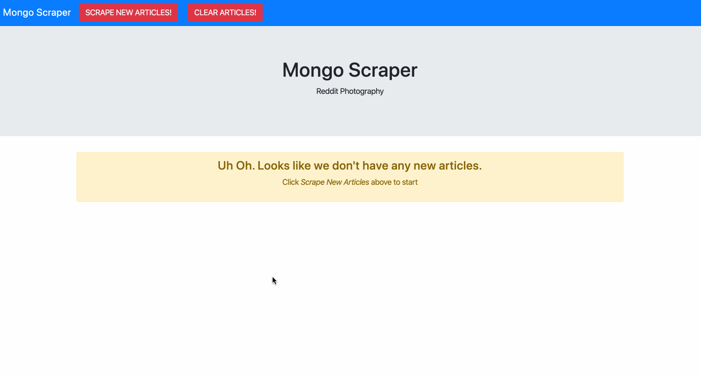

# Mongo Scraper
A web app that lets users view, leave and delete comments on the latest news. This version scrapes articles from Reddit's /r/photography subreddit.

## Demo



## Technologies Used


***Backend***

* Node.js
* MongoDB
* npm packages:
    * express
    * express-handlebars
    * mongoose
    * axios 
    * cheerio
* Heroku for deployment

***Frontend***
* JavaScript
* HTML
* CSS
* libraries:
    * JQuery
    * Bootstrap

## Code Highlights

Server-side code to scrape articles from Reddit's /r/photography subreddit and save them in our Mongo database:

```javascript
router.get("/api/fetch", function (req, res) {

    axios.get("https://www.reddit.com/r/photography/").then(function (response) {

        var $ = cheerio.load(response.data);

        $("div[data-click-id=background]").each(function (i, element) {

            var titleContainer = $(element).find("a[data-click-id=body]");
            var title = $(titleContainer).text();
            var link = $(titleContainer).attr("href");

            var description = $(element).find("div[data-click-id=text]").text();

            if (title && link) {
                db.Article.findOneAndUpdate({
                    link: link
                }, {
                    title: title,
                    link: link,
                    description: description
                }, { upsert: true }).catch(function (err) {
                    console.log("error inserting article");
                });
            }
        });

        res.status(200).end();
    });
});
```

## Links

[Deployed Portfolio Site - Heroku](https://immense-fortress-17271.herokuapp.com/)

[LinkedIn](https://www.linkedin.com/in/leticiaroncero/)
